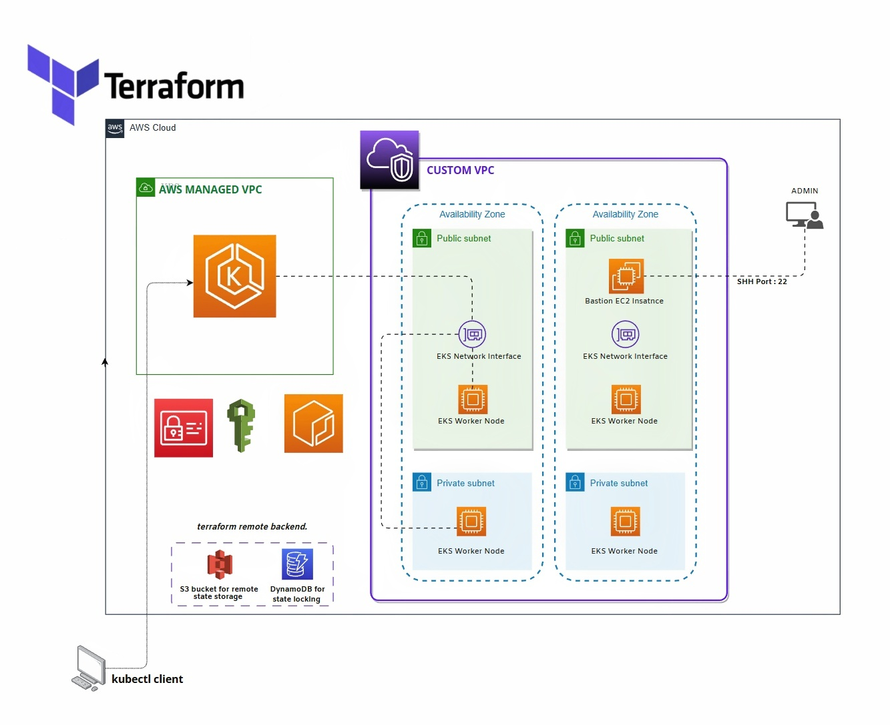

# Terraform VPC and EKS Project

#### 👷‍♀️ This Terraform project creates a custom VPC with public and private subnets, an EC2 bastion host with a security group in the public subnet, an EKS cluster with a network interface in the public subnet, and two EKS node groups in the public and private subnets. IAM roles are created for the EKS cluster and node groups, and the necessary policies are attached to them. Additionally, a null resource with remote-exec is used to copy the pem key to the bastion host so that the admin can access the node group from the bastion host. An Elastic IP is also allocated to the bastion host to provide a static public IP address.

## Prerequisites
Before you can run this project, you must have the following tools installed:

- Terraform v1.2 or higher
- AWS CLI v2 or higher

You must also have AWS credentials set up on your local machine.  
creat a key-value pair named "eks-terraform-key" and copy the pem file to private-key/eks-terraform-key.pem

## Getting Started
Follow these steps to get started with this Terraform project:

1. Clone the repository
2. Navigate to the project directory
3. Run `terraform init` to initialize the project
4. Run `terraform apply` to create the resources in AWS
5. Wait for the terraform apply command to finish executing
6. Make a note of the bastion host's public IP address

# Project Details

## VPC

The VPC is created using the `vpc` Terraform module, which sets up a custom VPC with two public subnets and two private subnets. the subnets are associated with a routing table that routes traffic to the Internet Gateway for the public subnets and the NAT Gateway for the private subnets.

## EC2 Bastion Host

The EC2 bastion host is created using the bastion Terraform module, which uses the `ec2_instance` module to create the instance. The bastion host is placed in a security group that allows incoming SSH traffic from the user's IP address. An Elastic IP is allocated to the bastion host to provide a static public IP address.

Additionally, a `null resource` is used with `remote-exec` to copy the pem key to the bastion host so that the admin can access the node group from the bastion host.

## EKS Cluster

The EKS cluster is created using the `aws_eks_cluster` Terraform resource and includes a network interface in the public subnet. The IAM role for the EKS cluster is created using the iam Terraform module, and the necessary policies are attached to the role using the iam_policy_attachment resource.

## EKS Node Groups

Two EKS node groups are created, one in the public subnet and one in the private subnet. The node groups are created using the `eks_node_group` Terraform resource, and the necessary IAM roles are created using the `aws_iam_role` role  and attached to the node groups using the `aws_iam_role_policy_attachment` resource.

## Further Steps

To further customize the project, you can modify the input variables in variables.tf. You can also modify the resources in the respective modules, such as bastion.tf and eks_cluster.tf, to change the configuration of the EC2 bastion host, EKS cluster, and node groups. You can also add more resources to the project as needed.

## Clean Up
To destroy the resources created by this Terraform project, run `terraform destroy`. This will remove the VPC, subnets, security groups, EC2 bast , EKS cluster
